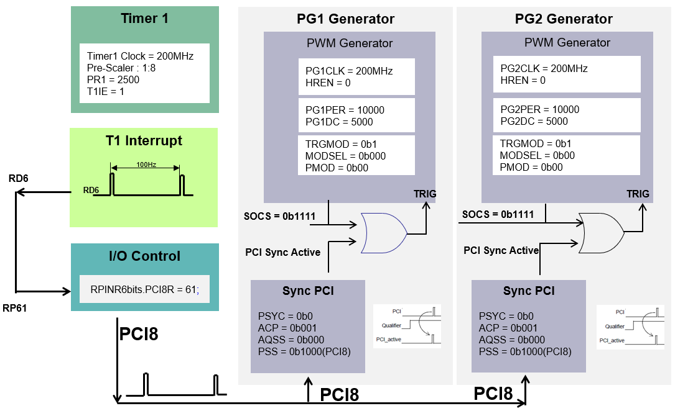

 

# PWM Peripheral Example: 
# External Synchronization - Sync PCI Feature of PWM using dsPIC33CK Curiosity Board

## 1. INTRODUCTION
This document describes the synchroniztion of PWM with an external pulse. This example explores Sync PCI feature of High Resolution PWM module in the dsPIC33CK to implement it. The demonstration uses the dsPIC33CK curiosity development board.

### 1.1 External synchronization using Sync PCI Feature 
The two PWM generators, PG1 and PG2 used in the example are configured in Independent edge, Complementary mode. 

Also, a Timer1 module is configured to generate a pulse signal at 100Hz on output port pin RD6. Another port pin, RC13(RP61/PWM8L/PMA5/RC13), is configured as the PWM PCI8.  The output pulse on port RD6 is applied to port RP61 by interconnecting them to produce an external synchronization signal to synchronize PG1 and PG2 generators.

The start of the cycle (SOCS PGxCONH<3:0>) of PG1 and PG2 are set to 0b1111 (PWM PCI sync function) to start on the PCI sync output. The input of the PCI sync block is the external signal applied on port RC13. Also, the sync polarity is set to High to trigger it on a rising edge of the external signal.
Refer the block diagram below for the configuration details.

  

  

When a rising edge is detected on the external synchronization signal applied on the port RC13/RP61(configured as PCI8), the PG1 and PG2 produce output pulses on PWM1H and PWM2H. Observe that the start of the cycle of both PG1 and PG2 is synchronized with the rising edge of the external sync signal.

In this configuration, the PWM generators PG1 and PG2 will send out PWMs only after detecting the external synchronization signal; before that, no PWM pulses are observed. 

  

  

## 2.	SUGGESTED DEMONSTRATION REQUIREMENTS
### 2.1 Application Example Firmware Required for the Demonstration
To clone or download this application firmware on GitHub, 
- Navigate to the [main page of this repository](https://github.com/microchip-pic-avr-examples/dspic33ck-curiosityboard-pwmexample-external-syncpci) and 
- On the tab **<> Code**, above the list of files in the right-hand corner, click Code, then from the menu, click **Download ZIP** or copy the repository URL to **clone.**

### 2.2	Software Tools Used for Testing the firmware
- MPLAB® X IDE **v6.10** 
- DFP: **dsPIC33CK-MP_DFP v1.11.346**
- MPLAB® XC16 Compiler **v2.00**

> **_NOTE:_**
>The software used for testing the model during release is listed above. It is recommended to use the version listed above or later versions for building the model.

### 2.3	Hardware Tools Required for the Demonstration
- dsPIC33CK Curiosity Development Board ([DM330030](https://www.microchip.com/en-us/development-tool/DM330030))

> **_NOTE:_**
>All items listed under this section Hardware Tools Required for the Demonstration are available at [microchip DIRECT](https://www.microchipdirect.com/).

## 3. HARDWARE SETUP

This section describes hardware setup required for the demonstration.

1. The board has an onboard programmer **'PICkit® On Board (PKoBv4)'**, which can be used for programming or debugging the dsPIC33CK256MP508. To use the on-board programmer, connect a micro-USB cable between Host PC and Micro USB **connector J7** provided on the dsPIC33CK Curiosity Development Board. 

    

    
 

2. Make sure that the **Jumper J11** is on the **+5V USB Power** side to power the dsPIC33CK Curiosity Development Board from Host PC through the USB cable. 
 

    

    

3. Interconnect the pins RD6 and RC13 on the dsPIC33CK curiosity board.
    

    

4. Connect the PWM pins RB10, RB11, RB12 and RB13 to the oscilloscope to monitor the PWM signals. 

## 4.	BASIC DEMONSTRATION

 Follow the instructions step-by-step, to set up and run the demo example:

1. Start **MPLAB® X IDE** and open the project **Ext_Trigger.X (File > Open Project)** with device selection **dsPIC33CK256MP508.**  
    

       

  
2. Set the project **Ext_Trigger.X** as the main project by right-clicking on the project name and selecting **Set as Main Project** as shown. The project **Ext_Trigger.X** will then appear in **bold.**
    

     

3. Right-click on the project **Ext_Trigger.X** and select **Properties** to open its **Project Properties** Dialog. Click the **Conf:[default]** category to reveal the general project configuration information. The development tools used for testing the firmware are listed in section [2.2 Software Tools Used for Testing the firmware.](#22-software-tools-used-for-testing-the-firmware).

     In the **Conf:[default]** category window: 
     - Ensure the selected **Device** is **dsPIC33CK256MP508.**
     - Select the **Connected Hardware Tool** to be used for programming and debugging. 
     - Select the specific Device Family Pack (DFP) from the available list of **Packs.** In this case, **dsPIC33CK-MC_DFP 1.11.346** is selected. 
     - Select the specific **Compiler Toolchain** from the available list of **XC16** compilers. 
     In this case, **XC16(v2.00)** is selected.
     - After selecting Hardware Tool and Compiler Toolchain, Device Pack, click the button **Apply**

     Please ensure that the selected MPLAB® XC16 Compiler and Device Pack support the device configured in the firmware.

     

     

4. To build the project (in this case, **Ext_Trigger.X**) and program the device dsPIC33CK256MP508, click **Make and Program Device Main project** on the toolbar.
    

    

5. Monitor the PWM signals on the pins RB10, RB11, RB12 and RB13 using oscilloscope.

## 	5. REFERENCES:
For more information, refer to the following documents or links.

1. [dsPIC33CK256MP508 Family Datasheet](https://ww1.microchip.com/downloads/en/DeviceDoc/dsPIC33CK256MP508-Family-Data-Sheet-DS70005349H.pdf)
2. [dsPIC33/PIC24 High-Resolution PWM with Fine Edge Placement Family Reference Manual](http://ww1.microchip.com/downloads/en/DeviceDoc/dsPIC33-PIC24-FRM-High-Resolution-PWM-with-Fine-Edge-Placement-70005320b.pdf)
3. [dsPIC33CK Curiosity Development Board User®s Guide](https://ww1.microchip.com/downloads/aemDocuments/documents/MCU16/ProductDocuments/UserGuides/dsPIC33CK-Curiosity-Development-Board-User%27s-Guide-DS50002859A.pdf)
3.	[MPLAB® X IDE installation](https://microchipdeveloper.com/mplabx:installation)
4.	[MPLAB® XC16 Compiler installation](https://microchipdeveloper.com/xc16:installation)
